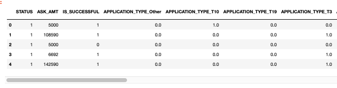
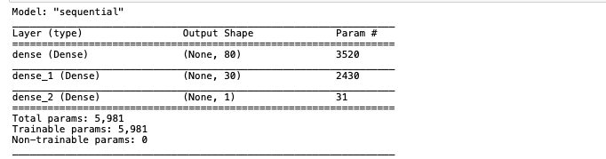
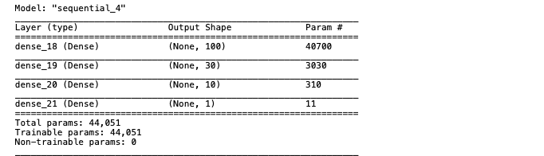

# Neural_Network_Charity_Analysis
Neural Network Model to predicting whether applicants will be successful if funded by Alphabet Soup

## Analysis overview

The purpose of this project is to use deep-learning neural network model to analyze and classify the success of charitable donations with the TensorFlow platform in Python. Analysis had following steps:

* preprocessing the data for the neural network model  
* compile, train and evaluate the model  
* optimize the model  

## Results

### Data preprocessing for the neural network model

1. I dropped the columns <code>EIN</code> and <code>NAME</code> as they are just identification information. This variables are neither targets nor features, and should be removed from the input data
2. The column <code>IS_SUCCESSFUL</code> contains binary data refering to weither or not the charity donation was used effectively. This variable is then considered as the **target** for our deep learning neural network.
3. The following columns <code>APPLICATION_TYPE, AFFILIATION, CLASSIFICATION, USE_CASE, ORGANIZATION, STATUS, INCOME_AMT, SPECIAL_CONSIDERATIONS, ASK_AMT</code> are the **features** for our model.
4. Encoding of the categorical variables, spliting into training and testing datasets and standardization have been applied to the features.

 

### Compilation, training and evaluation of the model

1. This deep-learning neural network model is made of two hidden layers with 80 and 30 neurons respectively.
The output layer is made of a unique neuron as it is a binary classification.
2. To speed up the training process, we are using the activation function ReLU for the hidden layers. As our output is a binary classification, Sigmoid is used on the output layer.
3. Model trained on 25724 samples, validate on 8575 samples.

 

4. For the compilation, the optimizer is adam and the loss function is binary_crossentropy.
5. The first model accuracy is 0.5324. 

### Optimization of model

This was not a satisfying performance to help predict the outcome of the charity donations.   
To increase model performance I was converting the NAME column into data points, which has the biggest impact on improving efficiency. And, it also required adding a third layer and using the "sigmoid" activation function for the 2nd and 3rd layer.

 

An applicant has a 80% chance of being successful if they have the following:

* The <code>NAME</code> of the applicant appears more than 5 times (they have applied more than 5 times)  
* The type of <code>APPLICATION</code> is one of the following; T3, T4, T5, T6, T7, T8, T10, and T19  
* The application has the following <code>CLASSIFICATION</code>; C1000, C2000, C3000, C1200, and C2100  
* That is the good model to recommend. Using this model produces a  0.7895 accuracy. 

## Summary

The relu and sigmoid activations yielded the 0.7895 accuracy, which is enough for our assigment (it is more that 75%). The model could produce using various number of neurons and layers. Using this model produces a 79% accuracy. 
